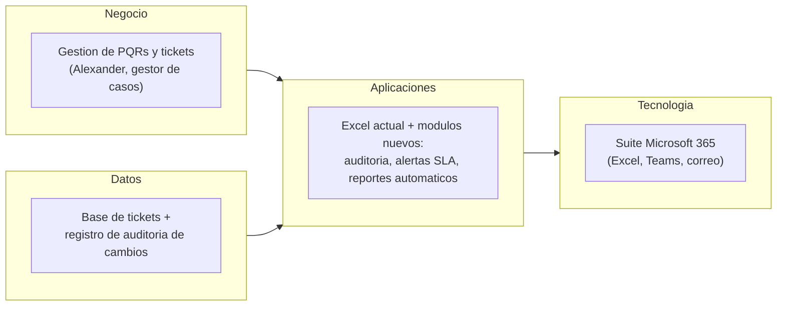

# Documento de Visión de Arquitectura

## 🔖 Cliente

Centro de Contacto (Contact Center) — Universidad de La Sabana. Contacto: Johanna Andrea Molina.

## 👥 Integrantes del equipo

- Juan David Orozco Rodríguez
- Nicolás Esteban Muñoz Sendoya

## 🗺️ Mapa conceptual de alto nivel

## 🚀 Beneficios esperados

| Objetivo estratégico (Ficha) | Beneficio esperado | Cómo se mide |
|---|---|---|
| Garantizar la trazabilidad y auditabilidad de la información | Registro completo de cambios sobre la base de datos (campo, valor anterior, valor nuevo, fecha y usuario) | % de modificaciones al Excel con registro de auditoría asociado |
| Cumplir el indicador institucional de oportunidad (80%) | Alertas tempranas, por Teams o correo, de los tickets que vencerán su SLA el mismo día | % de tickets cerrados a tiempo por semestre |
| Agilizar la entrega de reportes de gestión a las unidades | Generación automática de los reportes semestrales para "Ayúdanos a mejorar" e "Infórmate aquí" | Tiempo de generación del reporte semestral (antes/después) |
| Fortalecer la gestión de información dentro del marco tecnológico institucional | Solución construida enteramente sobre herramientas Microsoft 365 ya disponibles | N.º de aplicaciones externas requeridas (meta: 0) |

## 🧭 Alcance

| En alcance | Fuera de alcance |
|---|---|
| Diseño de un mecanismo de registro de auditoría (control de cambios) sobre la base de datos del Contact Center | Reemplazar la plataforma de tickets institucional (Anexo Unisabana) |
| Diseño de un esquema de alertas automáticas de vencimiento de SLA, dirigido al gestor de casos y a la supervisora | Migrar la información a herramientas externas no aprobadas por la universidad |
| Diseño de la generación automatizada de los reportes semestrales de las dos hojas de datos | Automatizar la resolución de fondo de los PQRs; el proyecto automatiza el control y el reporte, no la gestión sustantiva de cada caso |

## 💡 Justificación

Esta visión responde directamente a los cuatro problemas identificados en la Ficha de Caracterización: la falta de trazabilidad de cambios, la lentitud de los reportes manuales, las limitaciones de exportación de Anexo Unisabana y la ausencia de alertas tempranas. Cada uno de los tres componentes propuestos (auditoría, alertas y reportes automatizados) ataca uno de estos síntomas de forma directa, sin proponer todavía una solución técnica específica — eso corresponde a los talleres de Arquitectura de Aplicaciones y Tecnológica del Corte 2.

La visión también respeta la restricción más importante declarada por el cliente: operar exclusivamente dentro de la suite Microsoft 365 y las aplicaciones aprobadas institucionalmente, sin instalar software externo. Por eso el alcance excluye explícitamente reemplazar Anexo Unisabana o migrar información a herramientas no aprobadas, dejando esa validación de permisos y recursos disponibles como el siguiente paso acordado con el cliente antes de cerrar la propuesta técnica.
