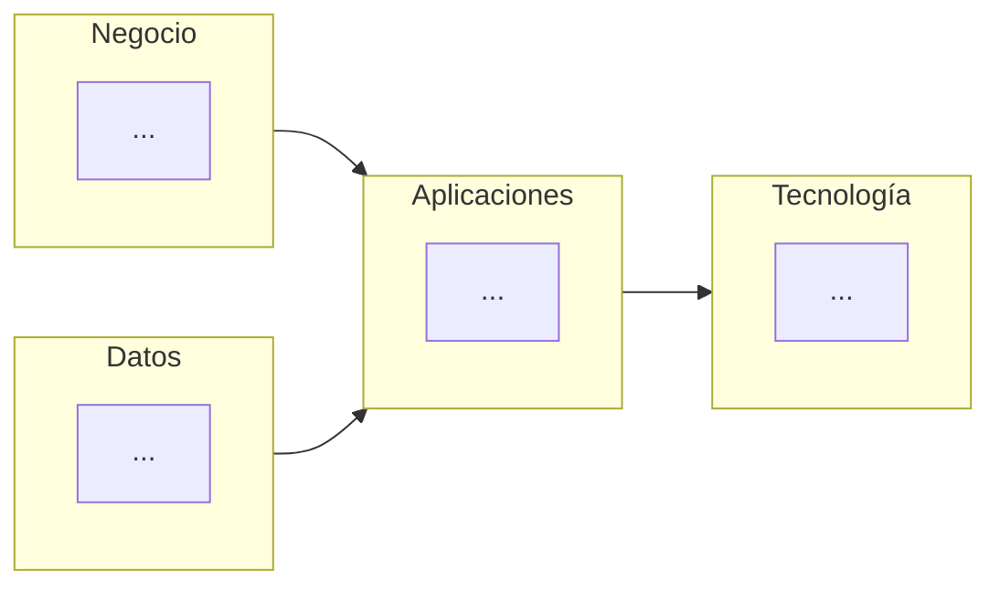

# 📄 Documento de Visión de Arquitectura

## 🔖 Cliente
Johanna Andrea Molina

## 👥 Integrantes del equipo
- Nicolas Esteban Muñoz Sendoya (nico9ms@hotmail.com / N1kxo)
- Juan David Orozco Rodriguez (davidorozcoj1@gmail.com / DavidOrozcoJ)

## 🗺️ Mapa conceptual de alto nivel

> Represente 4 a 6 cajas grandes (negocio, datos, aplicaciones, tecnología) — sin el nivel de detalle de un BPMN o un C4, ese trabajo llega en los Talleres 1 a 4. Puede usar un diagrama Mermaid (se renderiza en GitHub) o una imagen/boceto.

## 🚀 Beneficios esperados

Cada fila debe conectar un objetivo estratégico de la Ficha de Caracterización con un beneficio concreto y medible.

| Objetivo estratégico (Ficha) | Beneficio esperado | Cómo se mide |
|---|---|---|
| | | |
| | | |
| | | |

## 🧭 Alcance

| En alcance | Fuera de alcance |
|---|---|
| | |
| | |

## 💡 Justificación

Explique en 2-3 párrafos por qué esta visión responde a los objetivos estratégicos y problemas identificados en la Ficha de Caracterización, y cómo se relaciona con las restricciones declaradas por el cliente.

---

_Este documento hace parte de la entrega del Taller 0 del curso AREM (Arquitectura Empresarial) - Universidad de La Sabana._
