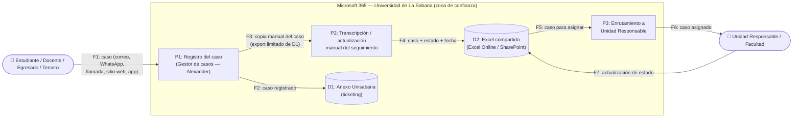

# 📄 Informe Técnico del Taller

## 🔖 Nombre del Taller
_Taller 5 - Evaluación de Seguridad con STRIDE_

## 👥 Integrantes del equipo
- Nicolas Esteban Muñoz Sendoya (nicolas.msendoya@gmail.com — GitHub: N1kxo)
- Juan David Orozco Rodríguez (davidorozcoj1@gmail.com — GitHub: DavidOrozcoJ)

## 🧠 Descripción general del trabajo
Este taller aplica el marco STRIDE (Spoofing, Tampering, Repudiation, Information Disclosure, Denial of Service, Elevation of Privilege) para analizar los riesgos de seguridad de un flujo crítico del proceso real del cliente: la gestión de casos PQRSF ("Comuníquese con Nosotros") del Centro de Contacto de la Universidad de La Sabana, atendido por Johanna Andrea Molina. Se siguió la metodología de 5 pasos de la guía del taller (DFD → elementos → categorías STRIDE → impacto/mitigación → priorización), completando además la columna de controles existentes con reconocimiento pasivo autorizado, sin ninguna prueba activa contra el sistema real.

## 🔧 Proceso de desarrollo
1. Se seleccionó como flujo crítico el **registro y enrutamiento de un caso PQRSF**, por ser el proceso donde ya se habían identificado en los Talleres 1 y 2 los problemas de auditoría, reportes manuales, limitaciones de exportación y falta de alertas de SLA — todos ellos con una lectura directa en términos de seguridad (integridad, repudio y disponibilidad).
2. Se construyó el diagrama de flujo de datos (DFD) del proceso real: recepción multicanal (correo, WhatsApp, llamadas, sitio web institucional, app Unisabana) → registro por el gestor de casos en Anexo Unisabana → transcripción manual al Excel compartido (la verdadera fuente de datos, dentro de Microsoft 365) → enrutamiento a la Unidad Responsable/Facultad.
3. Sobre cada elemento del DFD se aplicaron las 6 categorías STRIDE, priorizando los elementos donde ya existía evidencia documentada de debilidad (el Excel compartido y la falta de trazabilidad, principalmente).
4. Para la columna "Controles de Seguridad Existentes" se hizo reconocimiento pasivo: se verificó que el sitio institucional opera sobre HTTPS y publica una política de protección de datos pública; no se realizó ninguna prueba activa (inyección, fuerza bruta, manipulación de solicitudes) contra ningún sistema del cliente, siguiendo el límite estricto de la sección 5 de la guía del taller.
5. Se evaluó impacto, probabilidad y nivel de riesgo para cada amenaza, y se priorizó la tabla de mayor a menor riesgo antes de proponer las mitigaciones.

## 🧩 Análisis del modelo propuesto

### Diagrama de flujo de datos (DFD) — Registro y enrutamiento de un caso PQRSF

- **Límite de confianza:** entre el usuario que radica el caso por un canal externo (correo, WhatsApp, llamada, sitio web, app) y el entorno interno de Microsoft 365 de la Universidad.
- **Elementos:** 1 actor externo (usuario), 1 actor interno (Unidad Responsable), 3 procesos (P1–P3), 2 almacenes de datos (D1 Anexo Unisabana, D2 Excel compartido) y 7 flujos (F1–F7).

### Cómo se estructura el modelo entregado
La tabla `tabla-stride-cliente.xlsx` (plantilla oficial, hoja `Plantilla_STRIDE`) contiene 8 amenazas (T1–T8) que cubren las 6 categorías STRIDE, con dos categorías reforzadas con una segunda amenaza (Tampering e Information Disclosure) por ser los riesgos de mayor recurrencia sobre el Excel compartido, que actúa como la verdadera fuente de datos del proceso.

### Cómo representa las necesidades del cliente
El análisis conecta directamente cada amenaza con un problema ya reportado por el cliente en su ficha de caracterización:
- **T2/T3 (Tampering/Repudiation)** ↔ ausencia de auditoría de cambios en el Excel (problema #1 del cliente).
- **T7 (Tampering)** ↔ limitación de exportación de Anexo Unisabana que obliga a la transcripción manual (problema #3).
- **T5 (Denial of Service)** ↔ ausencia de alertas tempranas de SLA (problema #4).
- **T4 (Information Disclosure)** ↔ el archivo compartido como único repositorio de datos personales sensibles de PQRSF, sujeto a la Ley 1581 de 2012.

### Qué supuestos se tomaron
- Se asume que el acceso al Excel compartido y a Anexo Unisabana está limitado al tenant institucional de Microsoft 365 (no expuesto públicamente en internet), por ser la configuración estándar de estas herramientas y no haberse identificado lo contrario en el reconocimiento pasivo.
- Se asume que el "gestor de casos" (Alexander) es hoy el único punto de registro manual, según lo documentado en los talleres previos.
- No se tuvo acceso a credenciales ni a la configuración interna real de permisos del archivo Excel o de Anexo Unisabana; las columnas de controles existentes se basan en el comportamiento estándar de estas herramientas dentro de Microsoft 365 y en lo verificable públicamente, no en una auditoría interna.

## 📈 Diagrama final entregado
> DFD incluido arriba en este informe (Mermaid, se renderiza en GitHub). Tabla STRIDE completa: [`tabla-stride-cliente.xlsx`](./tabla-stride-cliente.xlsx).

## 📋 Tabla de actores, entidades o componentes

| Nombre del elemento | Tipo | Descripción | Responsable |
|---|---|---|---|
| Estudiante / Docente / Egresado / Tercero | Actor externo | Radica o consulta un caso PQRSF por correo, WhatsApp, llamada, sitio web o app | Usuario del servicio |
| Gestor de casos (Alexander) | Proceso | Registra el caso en Anexo Unisabana y lo transcribe al Excel compartido | Centro de Contacto |
| Anexo Unisabana | Almacén de datos | Plataforma de ticketing oficial; no exporta todos los campos requeridos | Equipo TI |
| Excel compartido (Excel Online / SharePoint) | Almacén de datos | Fuente de verdad real del seguimiento de casos, dentro de Microsoft 365 | Centro de Contacto / Equipo TI |
| Unidad Responsable / Facultad | Actor interno | Recibe el caso asignado y actualiza su estado | Facultades / Unidades académicas |

## 🔍 Investigación complementaria
### Tema investigado:
Buenas prácticas de seguridad de la información en el sector educación (ISO/IEC 27001 aplicada a instituciones de educación superior) y marco legal colombiano de protección de datos personales aplicable a un proceso PQRSF.

### Resumen:
La literatura consultada coincide en que las instituciones de educación superior manejan un volumen alto de datos personales sensibles (datos académicos, financieros, de identificación) que las convierte en objetivo frecuente de incidentes de seguridad, y en que ISO/IEC 27001 ofrece el marco de referencia más usado para estructurar un Sistema de Gestión de Seguridad de la Información (SGSI) en este sector, mediante identificación de activos críticos, evaluación de riesgos y controles técnicos/administrativos. En el caso analizado, el "activo crítico" no es un sistema único sino un proceso híbrido (Anexo Unisabana + Excel compartido dentro de Microsoft 365), lo que hace que varios controles típicos de ISO 27001 (control de acceso basado en roles, registro de auditoría, clasificación de la información) tengan que aplicarse sobre herramientas ofimáticas y no solo sobre software a la medida. A nivel legal, la Ley 1581 de 2012 (Habeas Data) exige que cualquier tratamiento de datos personales — como los que contiene cada caso PQRSF (nombre, correo, relato de la queja) — cuente con principios de finalidad, seguridad y confidencialidad, lo que refuerza directamente la mitigación propuesta en T4 sobre restringir y clasificar el acceso al Excel compartido.

## 📚 Referencias
Ver [`referencias.md`](./referencias.md).

---

_Este documento hace parte de la entrega del Taller 5 (Evaluación de Seguridad con STRIDE) del curso AREM (Arquitectura Empresarial) - Universidad de La Sabana._
